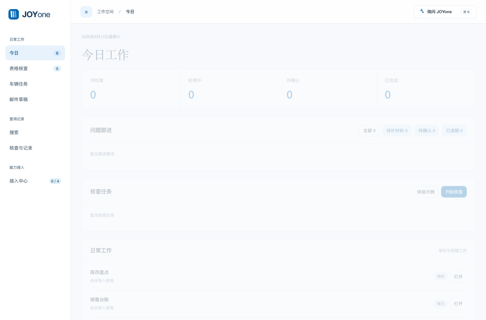

# JOYone 二手车运营智能工作台

> 二手车运营人员通过 AI 协作搭建的本地化工作台，用于管理车辆过户、检查 Sales 报表，以及按 VIN 查询 Outlook 邮寄记录。

**在线 Demo：** [打开 JOYone Demo](https://karji0415.github.io/joyone-used-car-operations/)　　
**项目案例：** [查看 Case Study](docs/case-study.md)　　
**需求文档：** [查看精简 PRD](docs/prd-lite.md)

> 公开版本仅使用虚构演示数据，不包含真实 VIN、车牌、价格、经销商或邮件。

## 项目成果

| 首月试运行指标 | 结果 |
|---|---:|
| 实际试用人数 | 3 人 |
| 管理车辆／过户案例 | 37 辆 |
| Sales 报表检查 | 25 次 |
| 发现报表错误 | 4 处 |
| 归档／查询邮件 | 70 余封 |
| 单次邮寄信息查询 | 约 3 分钟 → 10 秒 |

查询效率约提升 **18 倍**，单次查询耗时减少约 **94%**。以上为 1 个月小范围试运行结果，不代表长期或大规模使用效果。

报表检查发现的典型问题包括：公式单元格被数值覆盖，以及粘贴数据后局部格式错位。两类问题表面上仍可能显示正常内容，但会破坏后续自动计算或报表格式一致性。

## 为什么做

二手车运营信息分散在各类业务报表和 Outlook 邮件中。报表通常有固定的更新格式，但人工更新后的复核耗时较长；办理过户、退保及手续材料邮寄等任务时，也需要在多个工具之间反复切换、查找车辆信息。因此，我希望通过一个综合工作台，集中记录任务、追踪办理进度，并快速查询相关数据和邮件。

本项目聚焦三个真实问题：

1. **过户进度难追踪**：合同、材料、申章、付款和邮寄缺少统一视图；
2. **报表检查易遗漏**：公式、日期、数值和格式主要依靠人工核对；
3. **邮件查询耗时长**：邮寄记录散落在 Outlook 中，难以按 VIN 快速定位。

## 产品 Demo

Demo 内置虚构的车辆、任务、Sales 数据和邮寄记录，无需导入文件即可体验主要业务流程。

建议体验路径：

1. 在“今日概览”查看当天任务和往期待办；
2. 进入“过户”查看车辆的合同、材料及邮寄进度；
3. 输入 VIN 后 5 位，联查 Sales 信息和历史邮寄记录；
4. 运行报表检查，查看公式、数值及格式异常；
5. 将“待做合同”车辆加入后续办理流程。

下载仓库后，使用浏览器打开 [`index.html`](index.html) 即可运行 Demo。

## 核心功能

### 车辆过户管理

以车辆为中心管理合同、材料、委托书、申章、付款、邮寄和签收等节点，并关联任务与邮寄记录。

### Sales 报表检查

根据正确参考表形成检查规则，定位公式、日期、数值、格式和缺失列异常。系统只提示问题，不直接修改原文件。

### VIN 邮寄联查

通过完整 VIN 或后 5 位同时查询 Sales 字段和邮件历史，并对车牌、价格、经销商等冲突信息保留人工确认。

### Outlook 本地归档

监听指定文件夹，将原始邮件保存在本地，并提取 VIN、快递单号和邮寄内容形成查询索引。

## 项目材料

- [Case Study](docs/case-study.md)：实际使用、关键迭代、结果与反思；
- [精简 PRD](docs/prd-lite.md)：用户问题、功能范围、业务规则和验收标准；
- [测试说明](docs/testing.md)：关键业务场景如何被验证。

## 项目声明

本项目为个人 AI 协作实践，不代表所在公司的正式产品或官方立场。公开版本只包含虚构演示数据和脱敏后的业务案例。
