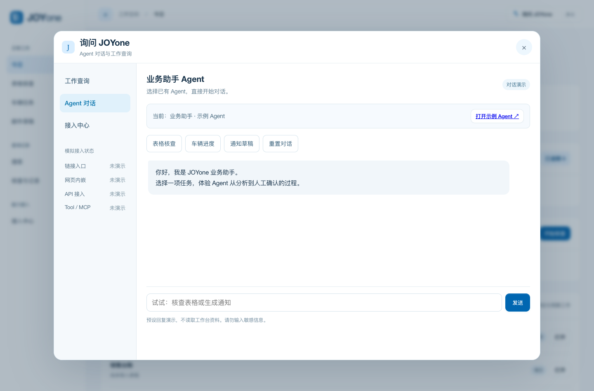
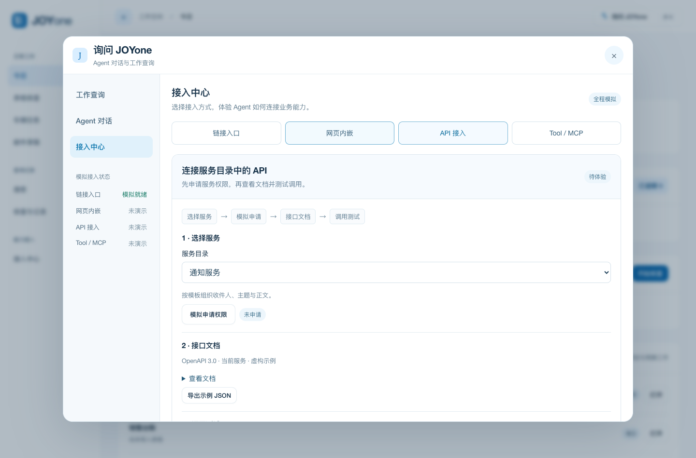

# JOYone · 二手车运营工作台

围绕表格核查、车辆任务和人工确认，把分散的业务工作集中到一个入口。

**[在线体验 · 支持手机](https://karji0415.github.io/joyone-used-car-operations/)** · **[查看最新托管版](https://joyone-remarketing-agent.karji415.chatgpt.site)** · **[产品说明](docs/prd-lite.md)**


## 最新版本

- **询问 JOYone**：右上角直接进入 Agent 对话，也可切换到工作查询。左侧不再重复设置 Agent 对话入口。
- **接入中心**：演示链接入口、网页内嵌、API、Tool / MCP 四种方式。
- **API 服务流程**：选择服务 → 模拟申请 → 查看或导出 OpenAPI 示例 → 测试调用。
- **核查与跟进**：检查差异、人工确认、材料补充、复核和记录形成闭环。

## 先体验什么

1. 在首页点击“体验示例”，查看销售台账的变化、缺项和不确定项。
2. 确认或退回核查结果，查看报告和后续跟进。
3. 点击右上角“询问 JOYone”，体验表格核查、车辆进度和通知草稿对话。
4. 打开左侧“接入中心”，依次体验四种接入方式。
5. 在 API 页模拟申请权限、导出示例 JSON，再切换成功、超时或授权失效场景。



## 功能与实现状态

| 功能 | 当前可体验内容 | 范围 |
|---|---|---|
| 表格核查 | 导入 Excel/CSV、比对差异、查看来源、人工决定、下载报告或工作副本 | 浏览器本地规则与文件处理 |
| 车辆任务 | 流程节点、备注、材料关联、待办跟进 | 当前浏览器保存 |
| 邮件草稿 | 模板填充、字段核对、复制、打开草稿 | 最终发送由用户完成 |
| 工作查询 | 查询已导入的表格及任务记录 | 本地规则查询，不是大模型推理 |
| Agent 对话 | 核查、进度、通知与人工确认 | 预设回复演示 |
| 服务接入 | 入口、内嵌、API、Tool / MCP | 虚构配置与模拟结果 |

## 四种接入方式

| 方式 | 展示界面 | 真实接入的前提 |
|---|---|---|
| 链接入口 | 检查入口并打开独立示例聊天页 | 获批的固定 Agent 链接及目标服务访问权限 |
| 网页内嵌 | 在窗口中聊天，也可模拟禁止内嵌 | 目标服务允许内嵌并兼容登录方式 |
| API | 服务目录、模拟申请、OpenAPI 示例与调用结果 | 接口文档、权限及独立服务端 |
| Tool / MCP | 选择协议、模拟连接、选择工具、调用及断开 | 对应协议的服务与已授权工具 |

Agent 的产品方向是使用已有聊天服务。普通网页链接并不等于 API 或 MCP 接口。公开版不会创建真实 Agent，也不会自动把工作台资料传给外部服务。



## 数据与人工控制

- 演示数据、服务配置和导出的 OpenAPI 文档均为虚构示例。
- 公开仓库不包含公司平台名称、内部网址、接口凭据或真实业务附件。
- 上传的工作簿与工作记录保存在当前浏览器；清除浏览器数据可能导致这些副本丢失，请保留原件和导出结果。
- 不确定匹配需要人工选择；文件变更先经审核，输出为工作副本。
- 模拟接口不会发送请求或邮件。网页不会自动读取邮箱、修改正式业务系统。
- GitHub Pages 仅运行静态演示，不运行真实 API / Tool / MCP 后端。真实服务应在获批环境单独部署。

## 本地运行

直接打开 `index.html`，或在仓库根目录启动静态服务器：

```sh
python3 -m http.server 8000
```

浏览器访问 `http://localhost:8000`。无需密钥或构建步骤。

## 项目文件

- [`demo/`](demo/)：当前工作台与接入演示。
- [`docs/prd-lite.md`](docs/prd-lite.md)：最新范围、规则和验收要求。
- [`docs/testing.md`](docs/testing.md)：验证方式与覆盖范围。
- [`docs/case-study.md`](docs/case-study.md)：早期试用记录及本轮演进；历史指标不代表当前 Agent 演示效果。
- [`outlook-vba/`](outlook-vba/)：保留的独立本地归档工具，当前网页未自动连接。

本项目为个人 AI 协作实践，不代表任何公司的正式产品。当前重点是验证业务流程与人工审核体验，不预设未经验证的提效数字。
