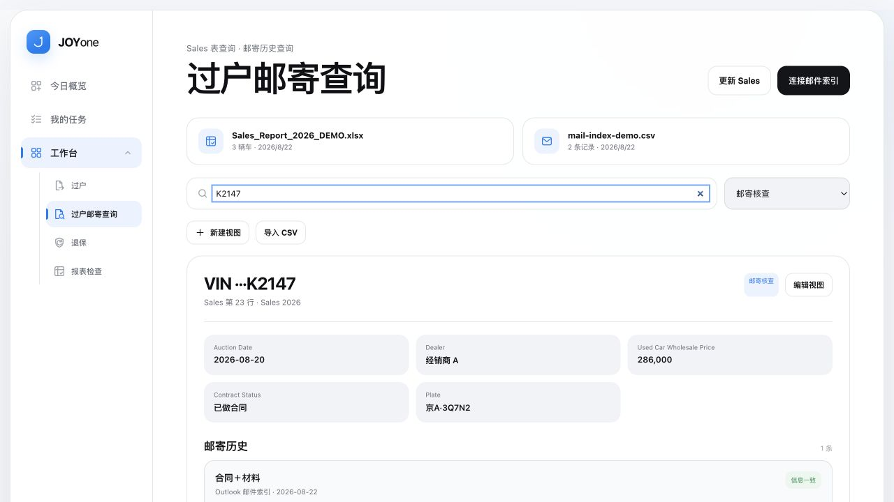

# JOYone 二手车运营智能工作台项目复盘

这份复盘记录了 JOYone 二手车运营智能工作台从想法到试用的过程。日期根据沟通记录和版本文件整理，个别节点为大致时间。

## 项目概况

| 项目 | 首月数据 |
|---|---:|
| 使用周期 | 1 个月 |
| 试用人数 | 3 人 |
| 管理车辆及过户案例 | 37 辆 |
| Sales 报表检查 | 25 次 |
| 发现报表错误 | 4 处 |
| 归档、查询邮件 | 70 余封 |
| 单次查询时间 | 从约 3 分钟降到约 10 秒 |

我负责梳理业务问题、拆分需求、检查结果并组织试用，具体实现主要通过 AI 协作完成。

## 版本时间线

| 大致时间 | 版本 | 调整重点 | 为什么调整 |
|---|---|---|---|
| 2026 年 7 月下旬 | v0.1 | 今日任务和逾期待办 | 先解决每天该做什么、哪些事情已经拖延 |
| 2026 年 7 月下旬至 8 月初 | v0.2 | 车辆进度和状态联动 | 任务清单看不到一辆车办理到哪一步 |
| 2026 年 8 月上旬 | v0.3 | Sales 报表检查 | 人工检查公式、日期、数值和格式耗时且容易漏项 |
| 2026 年 8 月中旬 | v0.4 | Outlook 邮件归档和 VIN 查询 | 邮件虽然保存下来了，但查找仍然很慢 |
| 2026 年 8 月中下旬 | v0.5 | 工作台首页和导航 | 功能增加后入口分散，使用顺序不够清楚 |
| 2026 年 8 月持续完善 | v0.6 | 异常处理、保存恢复和测试 | 试用中开始遇到格式变化、保存失败等边界情况 |
| 2026 年 8 月 21 日前后 | v1.0 | 首月数据整理 | 用实际使用结果检查项目是否解决了原来的问题 |

这些版本大致分为三类。前四个版本围绕业务流程，v0.5 和 v0.6 解决产品可用性，v1.0 用试运行数据做验证。

## 1. 每日任务管理与统一待办入口

最初，每天要处理的任务散在表格、邮件和个人记忆里，很难一眼看清当天安排和逾期事项。

第一版只做了任务中心，集中展示今日任务、历史待办和已完成事项。任务可以添加、编辑、删除，也可以按类型和状态筛选。这个版本很快解决了“今天做什么”的问题。

实际使用后又出现了新的问题。任务完成并不等于车辆流程完成。比如“准备合同”已经勾选，但这辆车是否收齐材料、是否完成申章、是否付款和邮寄，仍要到其他地方确认。任务需要和车辆进度连接起来。

## 2. 车辆进度管理与办理节点联动

第二版把车辆作为主要对象。每辆车记录合同、材料、申章、付款、退保和邮寄等节点，任务则对应其中的具体动作。

这一阶段主要做了三项调整。

1. 完成任务时，同步更新对应车辆的办理节点；
2. 从车辆状态自动生成待办，减少重复录入；
3. 把邮寄记录建成独立数据，记录 VIN、材料类型、快递单号和寄送时间，再关联回车辆。

邮寄方式也在试用中做了调整。同一快递单号可以包含多辆车和多类材料，不同单号则分别保存；删除邮寄记录后，对应的车辆步骤恢复为未完成。这样比简单区分“一起邮寄”或“分开邮寄”更符合实际情况。

这样处理后，任务回答“现在要做什么”，车辆页回答“这辆车办到哪一步”，两类信息不再互相替代。

## 3. Sales 报表异常检查与人工确认

Sales 报表的更新格式相对固定，但人工粘贴或修改后，仍可能出现公式被覆盖、日期异常、数值错误和格式错位。以前主要靠逐格检查，花时间，也容易漏掉细小问题。

报表检查功能最初只准备做规则校验。继续梳理后，我把需求拆成了四部分。

- 由用户提供一份确认正确的参考表，选择 Sheet、表头和检查范围，再生成规则；
- 检查公式、日期、数值、格式和缺失列是否符合规则；
- 显示异常位置、原始值和判断原因，方便复核；
- 识别“待做合同”等后续事项，提取 VIN、车牌、经销商和京内／京外信息，再由用户决定是否加入车辆流程。

演示数据从 2026 年 8 月 11 日前后的格式样例中抽取，再改写为虚构数据，用来覆盖正常和异常情况。

检查范围后来又补充到公式、日期或数字被保存为文本，以及同一天的数据没有连续排列等情况。上传的工作簿始终只读，工具不会直接修改原文件。

试运行期间共检查 25 次 Sales 报表，发现 4 处问题。其中两类比较典型。

### 案例一 公式单元格被数字覆盖

某个本应保留公式的单元格变成了固定数字。表面上数值正常，但后续更新时不会继续计算。

工具把这类单元格标记为异常，并显示位置和当前内容。业务人员确认后再恢复公式。

### 案例二 粘贴后格式错位

从其他表格粘贴数据后，部分单元格的格式和所在列不一致，人工浏览时不容易发现。

工具根据预设格式标记差异，由业务人员判断是误操作还是合理例外。

这两类问题也明确了功能边界。工具负责缩小检查范围并给出依据，最终修改仍由熟悉业务的人确认。

## 4. 基于 VIN 的邮件归档与查询

过户材料、退保资料和快递信息经常通过 Outlook 往来。第一步只是把邮件自动保存到本地目录，虽然解决了归档问题，但查找时仍要翻目录、看标题、打开正文。

后续我把需求改成按 VIN 建立索引，并逐步补全以下内容。

- 只处理用户指定的 Outlook 文件夹，在本地保存原始 MSG；
- 从邮件主题、正文和附件名中提取 VIN；
- 一封邮件包含多辆车时，为每辆车建立索引，但保留同一份原始邮件；
- 支持输入 VIN 后 5 位进行查询；
- 在同一页显示关联车辆、Sales 信息和历史邮件；
- 识别归档失败、重复邮件和无 VIN 邮件，保留人工处理入口。

Outlook 批量移动邮件时可能漏掉触发事件，因此工具启动时会重新扫描指定文件夹，再用唯一键去重。需要核对原始证据时，也只在用户主动操作后打开本地邮件。

试用期内共归档、查询 70 余封邮件，单次查询从约 3 分钟降到约 10 秒，时间减少约 94%。

这部分最重要的调整，是把“保存邮件”和“找到业务信息”分开看。归档只解决资料有没有留下，VIN 索引才解决需要时能不能快速找到。

## 5. 工作台入口与信息架构调整

任务、车辆、Sales 检查和邮件查询陆续加入后，页面开始出现功能虽然都有，但入口分散的问题。

因此我重新安排了首页和导航，让常用路径更接近日常工作。

1. 在今日概览查看任务和逾期待办；
2. 处理任务并更新车辆节点；
3. 查看车辆的完整办理状态；
4. 用 VIN 查询 Sales 和邮寄记录；
5. 复核报表异常并生成后续待办。

桌面端把具体业务模块收进工作台，移动端只保留常用入口，并记住上次打开的模块。产品名称也在这一阶段统一为 JOYone。

这次调整没有增加新功能，目的是减少理解和切换成本。对内部工具来说，功能放在哪里、先看到什么，会直接影响大家是否愿意持续使用。

## 6. 异常处理与数据恢复

演示版本只要流程顺畅就能运行，实际试用则会遇到导入格式变化、本地保存失败、字段缺失、重复记录以及邮件中没有 VIN 等情况。

针对这些问题，我补充了以下处理。

- 导入失败时的提示和回退；
- 本地保存失败时的备用处理；
- 备份、恢复、旧数据迁移和多窗口状态同步；
- 重复数据和缺失字段检查；
- VIN 和车牌脱敏，Excel、CSV 和 MSG 默认留在本地；
- 规则异常的人工确认入口；
- 基于固定样例的自动测试。

目前测试脚本包含 96 项断言。除了正常流程，还会检查周期任务是否重复生成、车辆是否重复创建、一封邮件关联多辆车时能否正确索引、删除邮寄记录后状态能否恢复，以及邮件与 Sales 冲突时是否会错误通过。

测试结果只用来说明规则在演示环境中能否稳定运行，实际效果仍以试用数据和业务反馈为准。

## 试运行结果

首月共有 3 人参与试用，管理了 37 辆车及相关过户案例。试用者已经在实际工作中使用报表检查和邮件查询。

首月数据让我看到了不同功能的实际效果。邮件查询节省的时间最直观；Sales 检查则减少了遗漏，并为后续处理指出了具体位置。

## 实践反思

### 从高频工作开始

任务中心是最早进入实际使用的功能，因为它解决了每天都要面对的任务安排问题。后续加入车辆管理时，也可以沿用任务入口更新办理进度。

### 功能增加前先梳理数据关系

任务、车辆、Sales 报表和邮件如果分别维护，新增功能只会带来更多重复录入。以 VIN 和车辆信息建立关联后，各个页面开始围绕同一辆车串联起来。

### 让检查结果有据可查

报表检查如果只给出“错误”提示，业务人员仍然很难判断问题。异常位置、原始值和检查规则需要一起展示，确认后再决定是否修改。

### 尽早记录使用情况

首月结束后整理试用结果，我才发现没有持续记录每周活跃人数、任务完成率和单次报表检查耗时。这些数据会从下一阶段开始按周记录，后续是否扩展功能也会参考实际使用情况。

### 保存每次迭代的过程

前期没有完整保留截图、用户反馈和修改前后的对比，后期只能依据版本文件和回忆整理。之后每次更新都会同步记录问题来源、具体调整和试用结果。
